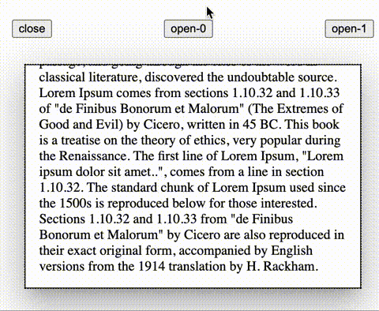

# MaterialDesignTransform

## Introduce

This component provide material design 2 and material design 3 transform for html element under `react-dom` framework.

## Feature

1. [SharedAxis](https://m2.material.io/design/motion/the-motion-system.html#shared-axis).


2. [FadeThrough](https://m2.material.io/design/motion/the-motion-system.html#fade-through).


3. [ContainerTransform](https://m2.material.io/design/motion/the-motion-system.html#container-transform)


- Tip: you can continue to toggle animation even animation is running.

## Install

```console
npm i material-design-transform
```

## Import

```jsx
import { SharedAxis, SharedAxisTransform } from "material-design-transform";

import { FadeThrough } from "material-design-transform";

import {
  ContainerTransform,
  ContainerTransformLayout,
} from "material-design-transform";
```

## Use

```jsx
const [id, setId] = React.useState(0);

<SharedAxis transform={SharedAxisTransform.fromTopToBottom} keyId={id}>
  {children}
</SharedAxis>;

<FadeThrough keyId={id}>{children}</FadeThrough>;
```

- New component only render after the old component exit animation completed.

```jsx
const [id, setId] = React.useState(undefined);

<ContainerTransformLayout keyId={id}>
  ...
  <ContainerTransform
    keyId={0 /* when [id] equal 0 */}
    container={<ElementShowOnExpanded />}
  >
    <ElementShowOnClosed />
  </ContainerTransform>
  ...
  <ContainerTransform
    keyId={1 /* when [id] equal 1 */}
    container={<ElementShowOnExpanded />}
  >
    <ElementShowOnClosed />
  </ContainerTransform>
  ...
</ContainerTransformLayout>;
```

- If ContainerTransformLayout's keyId `matches` one ContainerTransform's keyId, the ContainerTransform's container will be expanded with animation.
- ContainerTransform's keyId should be `unique` under same ContainerTransformLayout.
- ContainerTransform's children should be available to render two same element on single document at the same time. Or use ContainerTransform-`mock` to create a mock element for animation.
- ContainerTransform's `relative position` / `size` / `children` / `props` should not change when animation is running.
- ContainerTransformLayout itself should not have any [border](https://developer.mozilla.org/en-US/docs/Web/CSS/border) (but [outline](https://developer.mozilla.org/en-US/docs/Web/CSS/outline) is ok).
- ContainerTransform itself should not have any [padding](https://developer.mozilla.org/en-US/docs/Web/CSS/padding) or any [border](https://developer.mozilla.org/en-US/docs/Web/CSS/border) (but [outline](https://developer.mozilla.org/en-US/docs/Web/CSS/outline) is ok).
- ContainerTransform's animation `motion track` (only linear track) is different from origin material design because it only use css transition for animation that animation is limited by css.
- ContainerTransform's `box-shadow` and `border-radius` can be animated during animation.
- By default ContainerTransform will animate to match ContainerTransformLayout size and position, but you can edit [overlayPosition](./src/stories/ContainerTransform.stories.tsx) of ContainerTransformLayout to custom animation target.

## keyId

Change `keyId` to toggle switch animation. Only keyId change will toggle animation.

## transitionStyle

- "M2" meaning material design 2
- "M3" meaning material design 3

```jsx
import { SharedAxis, SharedAxisTransform, FadeThrough, ContainerTransformLayout } from "material-design-transform";

/* use material design 3 style */

<SharedAxis keyId={id} transform={SharedAxisTransform.fromTopToBottomM3}>
  {children}
</SharedAxis>

<FadeThrough keyId={id} transitionStyle="M3">{children}</FadeThrough>;

<ContainerTransformLayout keyId={id} transitionStyle="M3"></ContainerTransformLayout>
```

- Check out storybook in this project for more details.

## ContainerTransform

- `fit` - how the ContainerTransform's `children` / `mock` fit in ContainerTransform when animating

- `containerFit` - how the ContainerTransform's `container` fit in ContainerTransform when animating

ContainerTransformLayout only use transform. If ContainerTransformLayout's size don't change, the container's size would not change. So that user no longer need to care about layout problem during animation under new ContainerTransformLayout. Take advantage of ContainerTransform-`containerFit` to unlock more animation styles ([check out demo](./src/stories/ContainerTransform.stories.tsx)).



## Interactive Demo

- Run storybook in this project.

```console
git clone https://github.com/JohnGu9/material-design-transform.git
cd material-design-transform
npm i
npm run storybook
```

## Browser requirement

[ResizeObserver](https://developer.mozilla.org/en-US/docs/Web/API/ResizeObserver) support

| Browser       | Version (or newer) |
| ------------- | ------------------ |
| Chrome        | 64                 |
| Edge          | 79                 |
| Firefox       | 69                 |
| Safari        | 13.1               |
| Safari on iOS | 13.4               |

## Component dependencies

- react-dom
- react-ref-composer

## Issue report

https://github.com/JohnGu9/material-design-transform/issues

## LICENSE

[MIT](./LICENSE)
