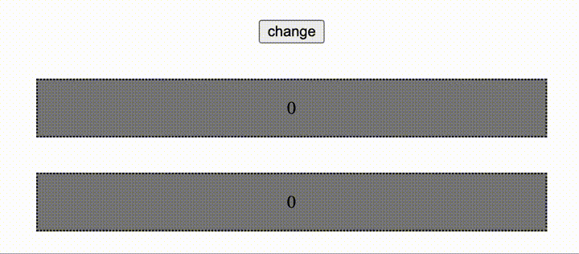
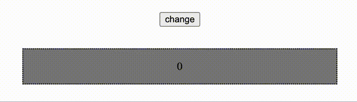
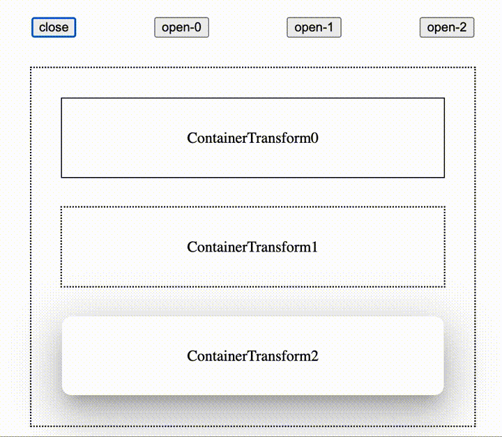

# MaterialDesignTransform

## Introduce

This component provide material design(v2) transform for html element under `react-dom` framework.

## Feature

1. [SharedAxis](https://m2.material.io/design/motion/the-motion-system.html#shared-axis).



2. [FadeThrough](https://m2.material.io/design/motion/the-motion-system.html#fade-through).



3. [ContainerTransform](https://m2.material.io/design/motion/the-motion-system.html#container-transform)



- Tip: you can continue to toggle animation even animation is running.

## Install

```console
npm i material-design-transform
```

## Import

```jsx
import { SharedAxis, SharedAxisTransform } from "material-design-transform";

import { FadeThrough } from "material-design-transform";

import {
  ContainerTransform,
  ContainerTransformLayout,
} from "material-design-transform";
```

## Use

```jsx
const [id, setId] = React.useState(0);

<SharedAxis transform={SharedAxisTransform.fromTopToBottom} keyId={id}>
  {children}
</SharedAxis>;

<FadeThrough keyId={id}>{children}</FadeThrough>;
```

- New component only render after the old component exit animation completed.
- Switch animation (SharedAxis / FadeThrough) state is toggled by properties changing and `transitionend` event of `opacity`. If opacity animate to 0 and toggle transitionend event that mean exit animation end. And if opacity animate to 1 and toggle transitionend event that mean enter animation end. Break transitionend event of opacity may break the component function.

```jsx
const [id, setId] = React.useState(undefined);

<ContainerTransformLayout keyId={id}>
  ...
  <ContainerTransform keyId={0} container={<ElementShowOnExpanded />}>
    <ElementShowOnClosed />
  </ContainerTransform>
  ...
  <ContainerTransform keyId={1} container={<ElementShowOnExpanded />}>
    <ElementShowOnClosed />
  </ContainerTransform>
  ...
</ContainerTransformLayout>;
```

- If ContainerTransformLayout's keyId `matches` one ContainerTransform's keyId, the ContainerTransform's container will be expanded with animation.
- ContainerTransform's keyId should be `unique` under same ContainerTransformLayout.
- ContainerTransform's children should be available to render two dom at the same time.
- ContainerTransform's `relative position` / `size` / `children` / `props` should be not change when animation is running.
- ContainerTransformLayout should not have any [border](https://developer.mozilla.org/en-US/docs/Web/CSS/border) (but [outline](https://developer.mozilla.org/en-US/docs/Web/CSS/outline) is ok).
- ContainerTransform should not have any [padding](https://developer.mozilla.org/en-US/docs/Web/CSS/padding) or any [border](https://developer.mozilla.org/en-US/docs/Web/CSS/border) (but [outline](https://developer.mozilla.org/en-US/docs/Web/CSS/outline) is ok).
- ContainerTransform's animation `motion track` is different from origin material design because it only use css transition for animation that animation is limited by css.
- ContainerTransform's `box-shadow` and `border-radius` can be animated.
- By default ContainerTransform will animate to match ContainerTransformLayout size and position, but you can edit [overlayStyle](./src/stories/ContainerTransform.stories.tsx) of ContainerTransformLayout to custom animation target.

## keyId

Change `keyId` to toggle switch animation. Only keyId change will toggle animation.

## Material Design v3

Waiting google release precise motion guide.

## Interactive Demo

```console
git clone https://github.com/JohnGu9/MaterialDesignTransform.git
cd MaterialDesignTransform
npm i
npm run storybook
```

## Component dependencies

- react-dom
- react-ref-composer

## Issue report

https://github.com/JohnGu9/MaterialDesignTransform/issues

## LICENSE

[MIT](./LICENSE)
